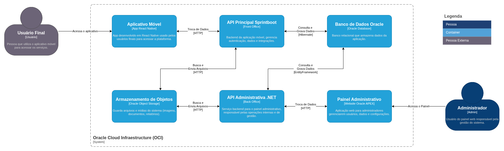

# Porquinho

[]()
[]()
[]()
[]()

O Porquinho é uma aplicação de controle financeiro pessoal desenvolvida para ajudar usuários a compreenderem seus hábitos financeiros e tomarem decisões mais conscientes sobre suas finanças.

O app permite o registro e acompanhamento de receitas, despesas e contas, promovendo uma visão clara sobre a situação financeira do usuário.

> Este repositório contém os arquivos da API Back Office, desenvolvida com .NET.

---

[Arquitetura de Solução](#arquitetura-de-solução) | [Endpoints Principais](#endpoints-principais) | [Setup do Projeto](#setup-do-projeto) | [Stack Tecnológica](#stack-tecnológica) | [Desenvolvedores](#desenvolvedores)

---

## Arquitetura de Solução



## Endpoints Principais

A seguir estão listados os principais endpoints disponíveis na API Back Office do projeto Porquinho.

### Health

```
GET    /health            Verifica se a aplicação está rodando corretamente
GET    /health/database   Verifica a conectividade com o banco de dados
```

### Usuários

```
GET    /api/v1/users              Lista todos os usuários  
GET    /api/v1/users/{id}         Retorna um usuário específico  
POST   /api/v1/users              Cadastra um novo usuário  
PUT    /api/v1/users/{id}         Atualiza informações de um usuário  
PATCH  /api/v1/users/{id}         Atualiza parcialmente os dados  
DELETE /api/v1/users/{id}         Exclui um usuário  
```

### Assinaturas

```
GET    /api/v1/subscriptions              Lista todas as assinaturas  
GET    /api/v1/subscriptions/{id}         Retorna uma assinatura específica  
POST   /api/v1/subscriptions              Cria uma nova assinatura  
PUT    /api/v1/subscriptions/{id}         Atualiza informações da assinatura  
PATCH  /api/v1/subscriptions/{id}         Atualiza parcialmente uma assinatura  
DELETE /api/v1/subscriptions/{id}         Remove uma assinatura  
```

### Status de Assinatura

```
GET    /api/v1/subscription-status              Lista os status existentes  
GET    /api/v1/subscription-status/{id}         Retorna um status específico  
POST   /api/v1/subscription-status              Cria um novo status  
PUT    /api/v1/subscription-status/{id}         Atualiza um status existente  
PATCH  /api/v1/subscription-status/{id}         Atualiza parcialmente um status  
DELETE /api/v1/subscription-status/{id}         Exclui um status  
```

### Tiers de Assinatura

```
GET    /api/v1/subscription-tiers              Lista os tiers de assinatura  
GET    /api/v1/subscription-tiers/{id}         Retorna um tier específico  
POST   /api/v1/subscription-tiers              Cria um novo tier  
PUT    /api/v1/subscription-tiers/{id}         Atualiza um tier existente  
PATCH  /api/v1/subscription-tiers/{id}         Atualiza parcialmente um tier  
DELETE /api/v1/subscription-tiers/{id}         Remove um tier  
```

### Funcionalidades

```
GET    /api/v1/functionalities              Lista todas as funcionalidades disponíveis  
GET    /api/v1/functionalities/{id}         Retorna uma funcionalidade específica  
POST   /api/v1/functionalities              Cria uma nova funcionalidade  
PUT    /api/v1/functionalities/{id}         Atualiza uma funcionalidade existente  
PATCH  /api/v1/functionalities/{id}         Atualiza parcialmente uma funcionalidade  
DELETE /api/v1/functionalities/{id}         Exclui uma funcionalidade  
```

## Setup do Projeto

### Instalação Local

Antes de iniciar, certifique-se de ter instalado:

- **.NET SDK** (versão 9.0.100 ou superior)

#### 1. Clonar Repositório

```bash
# Clonar o repositório
git clone https://github.com/PauloSergioFB/porquinho-admin-api.git

# Acessar o diretório
cd porquinho-admin-api

# Instalar as dependências
dotnet restore
```

#### 2. Configurar o Ambiente

Crie um arquivo .env na raiz do projeto com o seguinte conteúdo (substitua pelos seus próprios dados de conexão, usuário e senha):

```bash
ConnectionStrings__OracleConnection=Data Source=oracle.fiap.com.br:1521/orcl;User Id=<seu_usuario>;Password=<sua_senha>;
ASPNETCORE_ENVIRONMENT=Development
```

#### 3. Iniciar o projeto

```
dotnet run
```

Após a inicialização, a API estará disponível em: http://localhost:5070  
A documentação interativa (Swagger UI) pode ser acessada em: http://localhost:5070/scalar

### 4. Execução de Testes

Para rodar todos os testes automatizados do projeto:

``` bash
dotnet test
```


## Stack Tecnológica

O projeto utiliza as seguintes tecnologias:

- C# 12 - Linguagem principal utilizada na API.
- .NET 9 - Framework base para construção da aplicação com alto desempenho e suporte multiplataforma.
- Entity Framework Core - ORM utilizado para persistência e mapeamento objeto-relacional.
- Data Annotations - Mapeamento de entidades e validação de dados através de atributos.
- Minimal API - Abordagem leve e direta para definição dos endpoints HTTP.
- Swagger / OpenAPI - Ferramenta para documentação e teste interativo dos endpoints da API.

## Desenvolvedores

[@AntonioDeLuca](https://github.com/antoniodeluca) - Desenvolvedor Backend  
[@EnzoAzevedo](https://github.com/enzoazevedo) - Desenvolvedor Backend  
[@PauloSérgioFB](https://github.com/paulgramador) - Desenvolvedor Mobile
